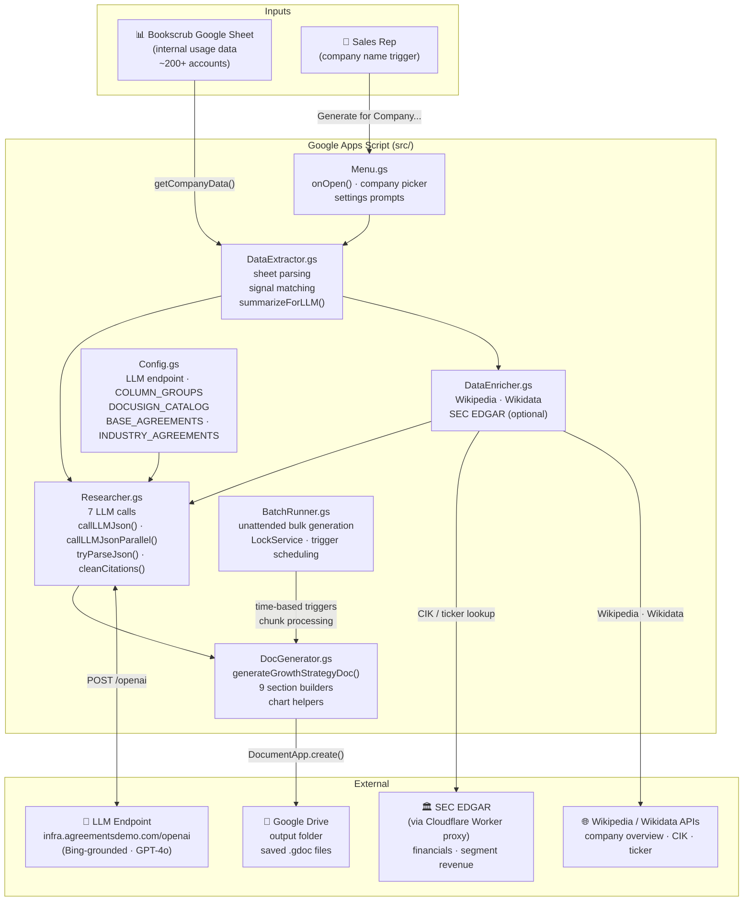
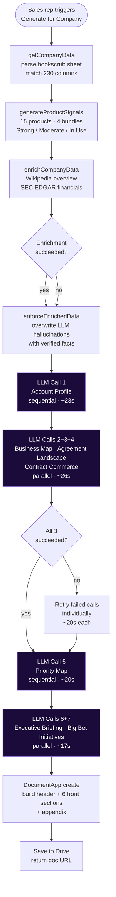
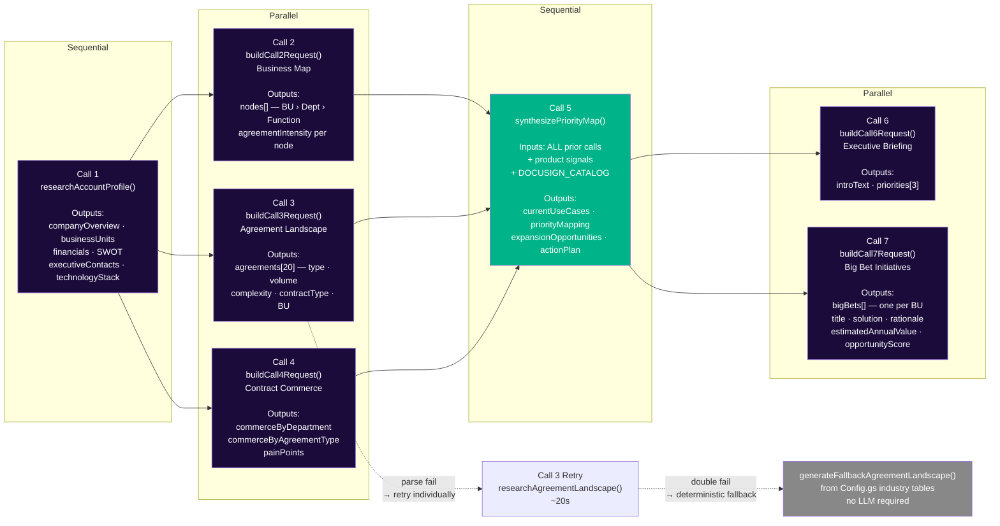
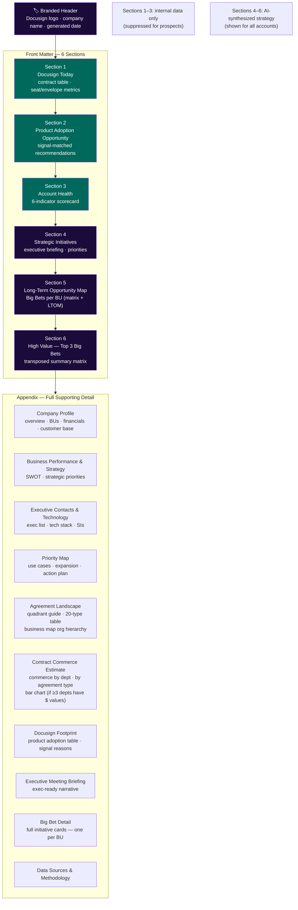
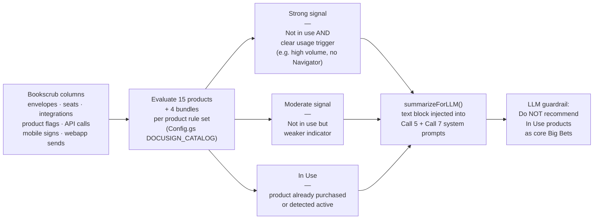
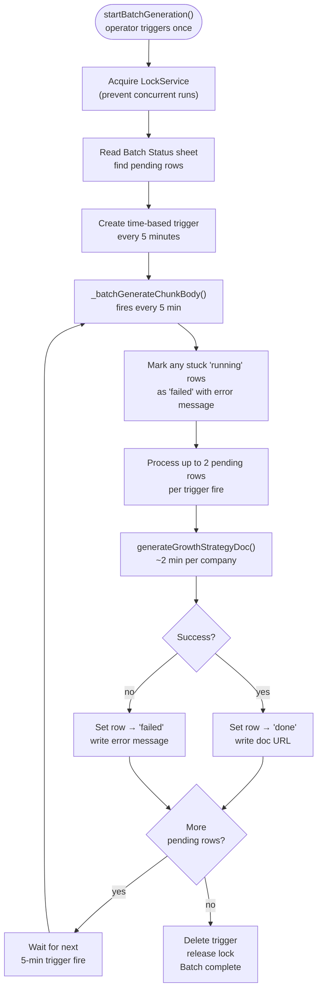

# Growth Strategy Report Generator

A Google Apps Script tool that generates comprehensive, AI-researched growth strategy Google Docs for Docusign customer accounts. It reads internal bookscrub usage data, enriches it with public data sources, runs a 7-call sequential/parallel LLM research pipeline, and produces a branded, multi-section strategic document saved to Google Drive.

Designed for on-demand use by sales reps via the Genius Bar infrastructure.

---

## System Architecture



---

## Execution Flow



---

## LLM Pipeline — Call Dependencies & Fallbacks



---

## Output Document Structure



---

## Signal Matching

Product signals are evaluated by `generateProductSignals()` in `DataExtractor.gs`. Each of the 15 products + 4 bundles is scored as **Strong**, **Moderate**, **In Use**, or not applicable based on bookscrub column values.



---

## Batch Runner Flow

For unattended bulk generation across many accounts:



---

## File Reference

| File | Role |
|---|---|
| `src/Config.gs` | LLM endpoint, `COLUMN_GROUPS`, `DOCUSIGN_CATALOG`, `BASE_AGREEMENTS`, `INDUSTRY_AGREEMENTS`, logo base64 |
| `src/DataExtractor.gs` | Bookscrub sheet parsing, signal matching, `summarizeForLLM()`, deterministic agreement fallback |
| `src/Researcher.gs` | All 7 LLM calls, `callLLMJson()`, `callLLMJsonParallel()`, `tryParseJson()`, `cleanCitations()` |
| `src/DocGenerator.gs` | `generateGrowthStrategyDoc()` orchestration, `addDocumentHeader()`, all section builders, chart helpers |
| `src/Menu.gs` | `onOpen()`, company picker dialog, settings prompts, `testGenerate()` |
| `src/DataEnricher.gs` | Wikipedia / Wikidata / SEC EDGAR enrichment (controlled by `ENRICHMENT_ENABLED` in Config.gs) |
| `src/BatchRunner.gs` | Unattended bulk generation via time-based triggers and LockService |
| `workers/sec-edgar-proxy/` | Cloudflare Worker that proxies SEC EDGAR API calls to avoid CORS restrictions from GAS |

---

## Deployment

```bash
# Push local .gs changes to Google Apps Script
clasp push

# Pull latest from Apps Script (if edited in browser)
clasp pull

# Deploy SEC EDGAR Cloudflare Worker
cd workers/sec-edgar-proxy && npm run deploy
```

**Required Script Properties** (set via **Growth Strategy > Settings** menu):

| Property | Description |
|---|---|
| `INFRA_API_KEY` | API key for the internal LLM endpoint |
| `INFRA_API_USER` | API user for the internal LLM endpoint |
| `OUTPUT_FOLDER_ID` | Google Drive folder ID where docs are saved |
| `SEC_PROXY_URL` | URL of the deployed Cloudflare Worker (optional) |
