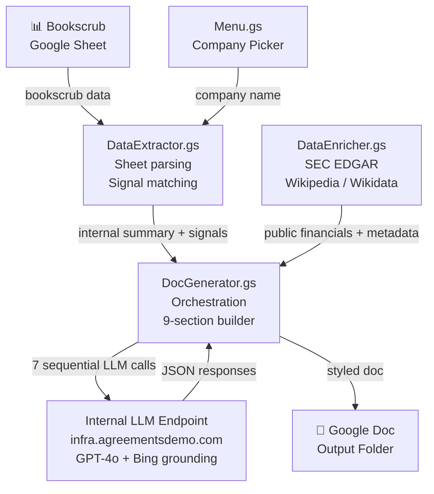
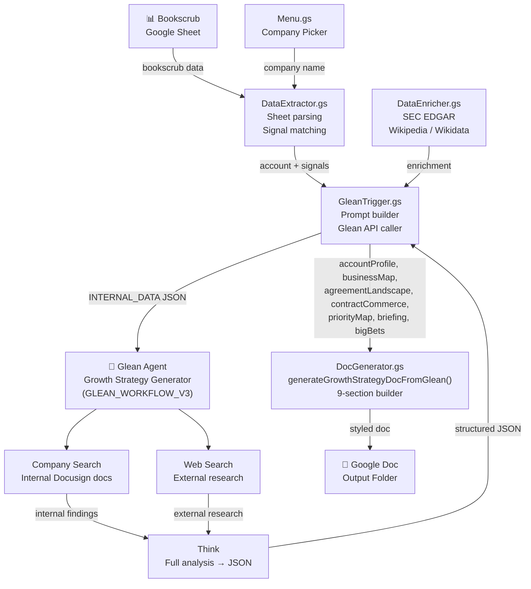

# Growth Strategy Generator — Overview

## What Is This?

A tool that generates an **executive-ready Growth Strategy document** for any Docusign
enterprise customer account — in minutes, not hours.

A sales rep selects a company from the bookscrub Google Sheet. The tool reads internal
Docusign usage data, enriches it with public financial and company data (SEC EDGAR,
Wikipedia, Wikidata), runs AI-powered research and synthesis, and produces a structured
Google Doc covering company profile, agreement landscape, expansion opportunities,
executive contacts, account health, and a prioritized action plan.

---

## Who Uses It

- **Account Executives** — strategic account prep before executive meetings
- **Customer Success Managers** — renewal and expansion planning
- **Solutions Architects** — identifying integration and product expansion opportunities

---

## Output Document Structure

| Section | Content | Data Source |
|---|---|---|
| Cover | Company, ACV, industry | Internal |
| Executive Briefing | 3 strategic priorities linking company initiatives to Docusign | AI |
| Docusign Footprint | Contract terms, consumption, seat usage, integrations | Internal |
| Product Adoption | Active vs. available products | Internal |
| Account Health | 10 scored health indicators (green/yellow/red) | Internal |
| Long Term Opportunity Map | Big Bet initiatives mapped to org units | AI |
| Company Profile | BUs, financials, key metrics | AI + Public |
| Business Performance | 3-year trend, SWOT, strategic initiatives | AI + Public |
| Executive Contacts | Key buyer personas with Docusign relevance | AI + Public |
| Business Map | Org hierarchy with agreement intensity | AI |
| Agreement Landscape | Top 20 agreement types scored by volume + complexity | AI |
| Contract Commerce | Commerce estimates by department and agreement type | AI |
| Priority Map | Docusign capability mapped to company priorities | AI |

---

## Architecture

### Current Architecture (GAS + Internal LLM)



**7 LLM calls** run in mixed sequential/parallel order inside `generateGrowthStrategyDoc()`:

| Call | Function | Uses |
|---|---|---|
| 1 | `researchAccountProfile()` | Company overview, BUs, financials, SWOT, execs, tech stack |
| 2 | `researchBusinessMap()` | Org hierarchy BU → Dept → Function |
| 3 | `researchAgreementLandscape()` | Top 20 agreement types (volume + complexity) |
| 4 | `researchContractCommerce()` | Commerce estimates by dept/agreement type |
| 5 | `synthesizePriorityMap()` | Recommendations + expansion opportunities |
| 6 | `generateExecutiveBriefing()` | 3-priority exec narrative |
| 7 | `generateBigBetInitiatives()` | 3–5 ranked growth opportunities |

Calls 2+3+4 run in parallel. Calls 6+7 run in parallel. Each call uses prior results as
context. Any failure falls back to `{}` and the affected section renders with placeholder
content. Call 3 also has a deterministic fallback (`generateFallbackAgreementLandscape()`).

---

### Target Architecture (Move to Glean — PRS-114 through PRS-117)



**Key change:** Glean replaces the 7 internal LLM calls. It returns a single structured
JSON object whose keys map directly to the existing section builder function signatures —
no translation layer required.

**Glean JSON top-level keys → Section builder mapping:**

| Glean JSON key | Section builder(s) that consume it |
|---|---|
| `accountProfile` | `addCompanyProfileSection`, `addBusinessPerformanceSection`, `addExecutivesAndTechSection`, `addLongTermOpportunityMapSection`, `addBigBetInitiativesSection` |
| `businessMap` | `addBusinessMapSection`, `addCompanyProfileSection`, `addLongTermOpportunityMapSection` |
| `agreementLandscape` | `addAgreementLandscapeSection` |
| `contractCommerce` | `addContractCommerceSection`, `addBigBetInitiativesSection` |
| `priorityMap` | `addPriorityMapSection`, `addDocusignTodaySection` |
| `briefing` | `addExecutiveBriefingSection`, `addStrategicInitiativesSection` |
| `bigBets` | `addBigBetInitiativesSection`, `addBigBetsDetailSection`, `addLongTermOpportunityMapSection` |

Sections that use **only internal bookscrub data** (`data`) are unaffected:
`addDocusignTodayContractSection`, `addProductAdoptionSection`, `addAccountHealthSection`.

---

## Key Files

| File | Role |
|---|---|
| `src/Config.gs` | Constants, LLM endpoint, column mappings (`COLUMN_GROUPS`), product catalog (`DOCUSIGN_CATALOG`), industry agreement tables |
| `src/DataExtractor.gs` | Bookscrub sheet parsing, signal matching (`generateProductSignals`), LLM text summary, deterministic agreement fallback |
| `src/DataEnricher.gs` | SEC EDGAR proxy + Wikipedia/Wikidata enrichment; controlled by `ENRICHMENT_ENABLED` flag |
| `src/Researcher.gs` | 7 LLM calls, `callLLMJson()` with retry + JSON parse, `cleanCitations()` |
| `src/DocGenerator.gs` | Orchestration entry point, all section builder functions, account health scorecard, table/chart helpers |
| `src/GleanTrigger.gs` | Glean API caller, prompt builder, `INTERNAL_DATA` export helper |
| `src/Menu.gs` | `onOpen()` menu wiring, company/group picker dialogs, settings prompts |
| `workers/sec-edgar-proxy/` | Cloudflare Worker that proxies SEC EDGAR API calls (avoids CORS from GAS) |
| `prompts/GLEAN_WORKFLOW_V3.md` | Glean agent setup guide: 4-step workflow spec + exact JSON output schema |

---

## Script Properties (required before first run)

| Property | Description |
|---|---|
| `INFRA_API_KEY` | Internal LLM endpoint key |
| `INFRA_API_USER` | Internal LLM endpoint user |
| `OUTPUT_FOLDER_ID` | Google Drive folder ID for generated docs |
| `SEC_PROXY_URL` | Cloudflare Worker URL for SEC EDGAR proxy (optional) |
| `GLEAN_API_BASE` | Glean API base URL (for Glean path) |
| `GLEAN_API_KEY` | Glean API key with agent chat permissions |
| `GLEAN_AGENT_ID` | Agent ID from the Glean agent configuration page |

Set via **Growth Strategy → Settings** in the bound Google Sheet.

---

## Deploy

```bash
# Push GAS changes
clasp push

# Deploy SEC EDGAR proxy
cd workers/sec-edgar-proxy && npm run deploy
```

Test via **Growth Strategy → Test Generate** in the bound Google Sheet (no local runner).
